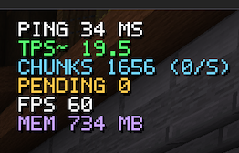
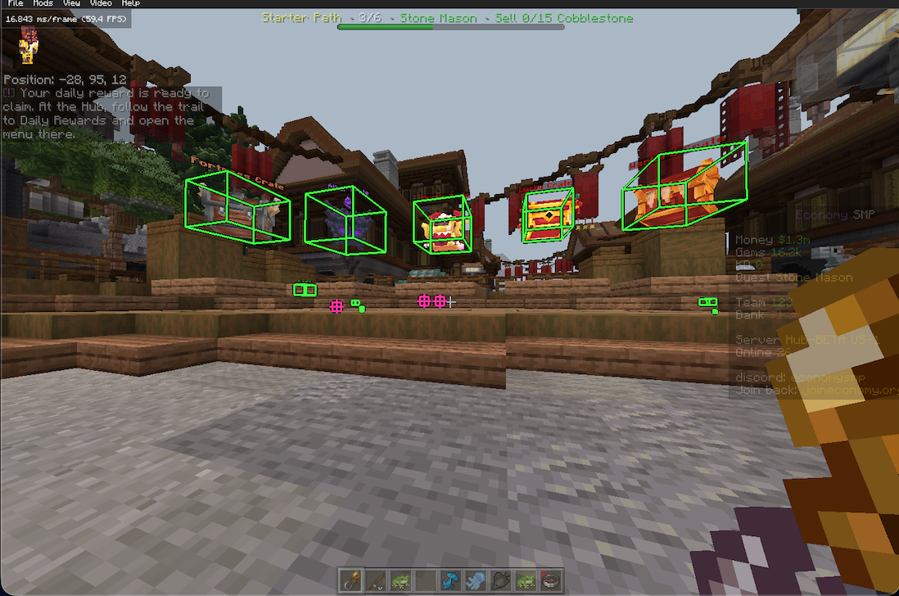

# Dobby

Compact Minecraft Bedrock developer client for macOS
[mcpelauncher](https://github.com/minecraft-linux/mcpelauncher-manifest).

It captures packet violations and raw decode evidence, displays entity/player hitboxes, outlines client-known chests and ores, and shows native RakNet and chunk metrics.

## In-game diagnostic

`Mods > Dobby` contains the developer overlay. It shows native `PING`, client-observed `TPS~`, loaded chunks and outstanding requests, plus client `FPS` and resident memory use.



`Chest ESP` outlines chests found in Bedrock's decoded client chunk storage. It does not request or modify world data, so concealed chests appear only if the server actually sent them.

`Ore ESP` scans the same client-decoded subchunk palettes for vanilla ores and ancient debris. It outlines only blocks already present in client memory and never requests or modifies chunk data.

Menu toggles are saved locally and restored on the next launch.




## Target

- Minecraft Android `1.26.40.5`
- `arm64-v8a`
- `libminecraftpe.so` build ID `5893edc8d56c93cbdb50e0f9436320236b78c89d`

The mod validates the target signature and refuses to patch incompatible builds.

## Build

```sh
./build.sh
```

The default workflow runs release and sanitizer tests, builds ARM64, audits public
content, installs the verified artifact, commits and pushes changes, then starts
Minecraft and confirms Dobby is ready. Use `./build.sh --local` for a build-only
iteration or `./build.sh --help` for individual opt-outs.

Logs default to `~/Library/Application Support/mcpelauncher/`. Set
`DOBBY_OUTPUT_DIR` to override the output directory. Optional configuration:

- `DOBBY_AUTO_POPUP=0` disables automatic violation popups.
- `DOBBY_VERBOSE=1` enables verbose developer events.
- `DOBBY_HISTORY_LIMIT=100` sets the bounded in-memory history size.
- `DOBBY_RAW_CAPTURE_LIMIT=2048` sets the maximum captured packet-body bytes.

Raw captures and logs may contain server-provided data and remain excluded from Git.
