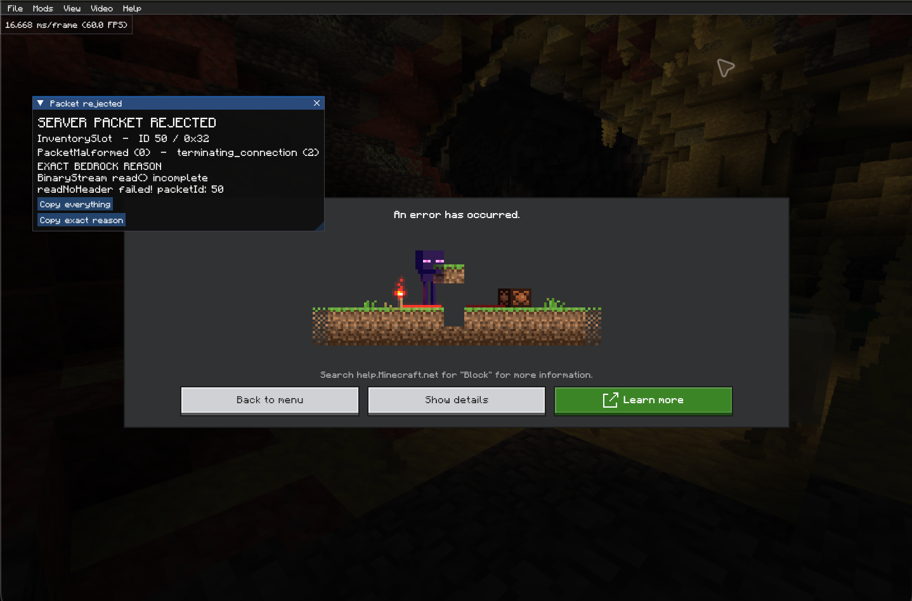

# Bedrock Packet Debugger

Developer tool for diagnosing Minecraft Bedrock packet violations with macOS
[mcpelauncher](https://github.com/minecraft-linux/mcpelauncher-manifest).

It captures `PacketViolationWarningPacket`, displays the exact reason in a compact in-game window,
and provides clipboard-ready diagnostics and JSON logs.

## In-game diagnostic

Shows the rejected packet, violation type, exact Bedrock reason, and copyable diagnostics without leaving the game.



## Target

- Minecraft Android `1.26.40.5`
- `arm64-v8a`
- `libminecraftpe.so` build ID `5893edc8d56c93cbdb50e0f9436320236b78c89d`

The mod validates the target signature and refuses to patch incompatible builds.

## Build

```sh
cmake -S . -B build-host -DCMAKE_BUILD_TYPE=Release
cmake --build build-host
ctest --test-dir build-host --output-on-failure

cmake -S . -B build-android-arm64 -DCMAKE_BUILD_TYPE=Release \
  -DCMAKE_TOOLCHAIN_FILE="$ANDROID_NDK_HOME/build/cmake/android.toolchain.cmake" \
  -DANDROID_ABI=arm64-v8a \
  -DANDROID_PLATFORM=android-23
cmake --build build-android-arm64 --target packet_debugger
```

Logs default to `~/Library/Application Support/mcpelauncher/`. Set
`PACKET_DEBUGGER_OUTPUT_DIR` to override the output directory.
